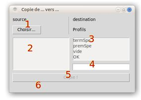

# CopieDoc

CopieDoc est un programme python permettant de faire des copies multiples de fichiers vers des dossiers déjà choisis, inscrits dans un "profil".

## Installation

Pas d'installation particulière. Ce script fonctionne avec python (bien avec une version >= 3.6).

## Préparation

Avant la première utilisation, (au moins) un "profil" doit être écrit dans le fichier "profils.ini". Ce fichier est dans le même répertoire que le script python "copiedoc.py". Le format de ce fichier est :

``` ini
[nom_profil]
chemin/dossier_destination
chemin2/dossier_destination_autre
```

## Utilisation

Avec Linux ou windows, en ligne commande :

``` bash
python3 copiedoc.py
```

Avec windows, clic-droit sur le script, choisir "ouvrir avec...", puis choisir "python.exe" ou "pythonw.exe" (en général dans "c:\\python3.*").



Dans l'interface graphique :

1. choisir le ou les fichiers à copier
2. la liste apparait
3. choisir le profil (en 6 un message apparait pour indiquer un éventuel problème de chemin ou le nom du profil choisi)
4. [option] le nom d'un dossier à créer en plus dans chacun des chemins/répertoires du profil choisi
5. copie des fichiers
6. message que tout va bien (ou pas) !


## Licence
[MIT](https://choosealicense.com/licenses/mit/)