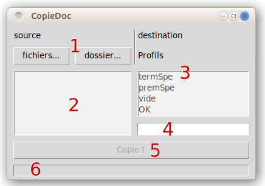

# CopieDoc

CopieDoc est un programme python permettant de faire des copies multiples de fichiers et ou dossiers vers des dossiers déjà choisis, inscrits dans un "profil".

## Installation

Pas d'installation particulière. Ce script fonctionne avec python (bien avec une version >= 3.6).

## Préparation

Avant la première utilisation, au moins un "profil" doit être écrit dans le fichier "profils.ini". Ce fichier est dans le même répertoire que le script python "copiedoc.py". Le format de ce fichier est :

``` ini
[nom_profil]
chemin/dossier_destination
chemin2/dossier_destination_autre
```

## Utilisation

Avec Linux ou windows, en ligne commande :

``` bash
python3 copiedoc.py
```

Avec windows, clic-droit sur le script, choisir "ouvrir avec...", puis choisir "python.exe" (en général dans "c:\\python3.*").

{width=280px}

Dans l'interface graphique :

1. choisir le ou les **fichiers** à copier ou choisir le **dossier** à copier
2. la liste de tous les fichiers
3. choisir le profil
4. [option] le nom d'un dossier à créer dans chacun des chemins/répertoires du profil choisi
5. copie des fichiers !
6. message :
    - le nom du profil choisi
    - éventuel problème de chemin pour le profil choisi (l'erreur est dans la console)
    - copie réussie !
    - éventuel problème de copie (nom de fichier dans la console)


## Licence
[MIT](https://choosealicense.com/licenses/mit/)